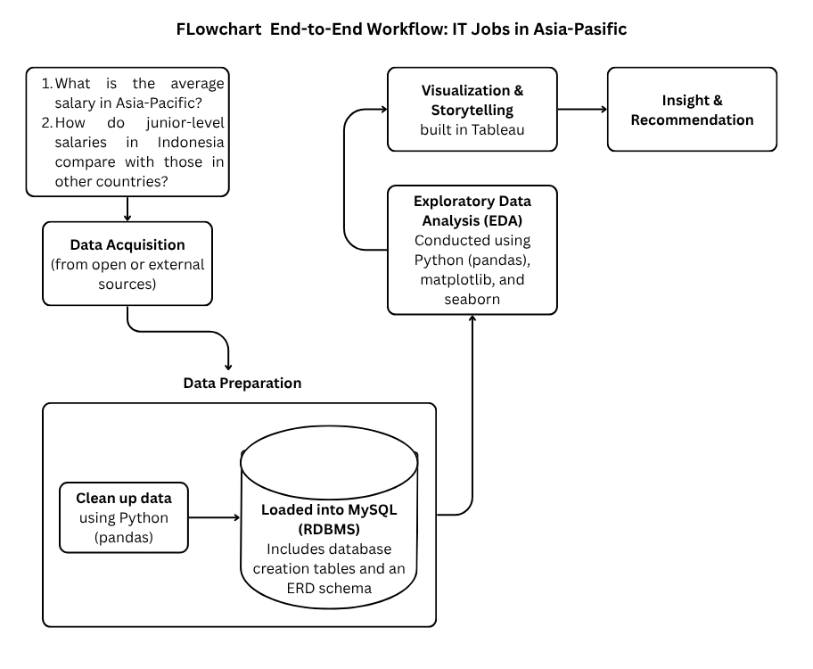
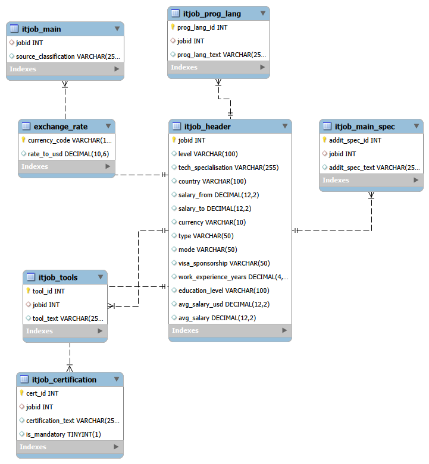

# 📊 End-to-end_Analytical_Workflow_IT_Jobs_in_Asia-Pacific
End-to-end analysis of IT job market in Asia-Pacific. Data cleaned with Python, explored and joined using SQL, visualized in Tableau to reveal trends in skills, tools, programming languages, and their relation to salary and job level.

---

## 🧭 Overview
This project presents a complete analytical workflow exploring IT job market trends in the Asia-Pacific region.  
It covers **data cleaning using Python (Pandas)**, **exploratory data analysis using SQL dan libraries in Python**, and **interactive visualization using Tableau**.  
The main goal is to identify job demand, required skills, and salary patterns across countries and job levels.

---

## 🎯 Objectives
- Identify the most demanded IT roles, tools, and programming languages.  
- Explore salary distribution by country, specialization, and job level.  
- Translate analytical results into clear, actionable insights.

---

## 🧹 Data Preparation
Data cleaning was performed in **Python**, including handling missing values, standardizing text formats, and filtering relevant attributes.  
After cleaning, a relational **MySQL database** was created based on the dataset, consisting of **6 tables**.  
All SQL scripts and the ERD schema are included in the `data_preparation_after_cleaning` folder.

📂 **Tables:**
- `itjob_header`
- `itjob_main`
- `itjob_tools`
- `itjob_prog_lang`
- `itjob_certification`
- `itjob_main_spec`

📘 **Dataset Source:**  
Dataset of IT Job Vacancies and Requirements in the Asia-Pacific Region  
👉 [Kaggle - Sergey Chekurin (2024)](https://www.kaggle.com/datasets/sergeychekurin/it-jobs-in-asia-pacific-region-may-june-2024)

### 🧩 Entity Relationship Diagram (ERD)

---

## 🧠 Exploratory Data Analysis (SQL)
EDA was conducted using **Python** to uncover job demand trends, required skills, and salary insights — focused on **Distibution and Salary IT jobs**.  
All queries are stored in the file `eda_result.ipynb`.

### Key Findings
- **The overall salary distribution** is heavily right-skewed, meaning most employees earn low to mid-range salaries, while only a few receive very high salaries.
There are 191 detected outliers in the salary data, mostly in the higher range — indicating a small group of top earners.
- **Salary trends by level**:
  - Salaries generally increase from Junior → Mid → Senior → Lead, showing a clear progression with experience and responsibility.
  - However, the increase is not strictly linear — some levels show overlapping salary ranges.
  - The Middle level has many outliers, suggesting wide variation in pay for similar positions (possibly due to differing skills, company size, or location).
  - The Senior level shows a large interquartile range (IQR), meaning salary variation is also high among experienced professionals.
- **Cross-country comparison**:
  - Australia and New Zealand stand out with significantly higher salary ranges across all levels.
  - This implies that talent costs in these countries are substantially higher compared to other regions.
- **Indonesia-specific insights**:
  - The salary distribution is right-skewed, with most employees earning around $300–$700 USD/month.
  - A few positions earn up to $2000 USD, which are rare but notable outliers, likely belonging to senior or specialized IT roles.
  - Outliers are especially visible at the Senior and Lead levels, reflecting both underpaid and overpaid cases relative to the national average.
  - HR departments should regularly conduct market salary benchmarking to ensure competitiveness and fairness in compensation.

---

## 📊 Dashboard (Tableau)
An interactive **Tableau dashboard** visualizes job distribution, salary trends, and specialization insights across countries.  
Users can filter data by **country, job level, and education level**.

🔗 **View Dashboard Online:**  
[👉 Tableau Public Link](https://public.tableau.com/views/ExecutiveDashboardITJob/Dashboard1?:language=en-US&:sid=&:redirect=auth&:display_count=n&:origin=viz_share_link)

---

## 💡 Insights
- In general, most IT salaries fall within the low to middle range. However, there are a few high-paying positions across all job levels — from Junior to Lead — depending on country and specialization.
- **Average salaries increase** with higher job levels, showing that experience level strongly influences pay.
  - The Mid-level shows the widest salary variation, especially in Indonesia, where many Mid-level roles are paid unevenly.
  - Some Junior-level positions in Indonesia are underpaid compared to the regional market.
- The dataset contains **884 IT job postings** in total:
  - Mid-level: 511 jobs
  - Senior-level: 283 jobs
  - Junior-level: 65 jobs
- Countries with **the most IT job openings**:
  - 🇵🇭 Philippines: 25.45% (225 jobs)
  - 🇦🇺 Australia: 23.19% (205 jobs)
  - 🇸🇬 Singapore: 14.93% (132 jobs)
  - 🇮🇩 Indonesia: 68 jobs → Junior (16), Mid (45), Senior (7)
- The **Mid-level** dominates in most countries, suggesting that companies prioritize experienced but affordable talent.
- Indonesia may need more Junior-level recruitment to support talent regeneration. 

---

## 🧭 Recommendations for Companies & HR
- **Increase Junior-level recruitment** to build **a sustainable talent pipeline**.
  - The average Junior and Senior salaries in Indonesia are significantly lower than in Malaysia and Singapore.
  - For example, the Senior Help Desk & IT Support salary in Indonesia ($555) is lower than the Junior level in Malaysia ($1,014).
  - The Junior Engineering–Software salary in Indonesia ($430) is almost 3× lower than in Malaysia ($1,133).
- **Avoid underpaying employees** to maintain motivation and work quality.
  - Competitive compensation improves employee retention and performance.
- **Benchmark regularly** against regional salary data to stay competitive and attract high-quality IT talent.

---

## 🧰 Tools Used
| Tool | Purpose |
|------|----------|
| **Python (Pandas, NumPy, Matplotlib, Seaborn)** | Data cleaning and preparation |
| **MySQL** | Preparation, EDA and query-based insights |
| **Tableau** | Interactive visualization and dashboarding |

---

## 🚀 Next Steps
- Extend EDA using **Python (Matplotlib, Seaborn)** for visual statistical analysis.  
- Develop an **Excel-based dashboard** for business-style reporting.
👉 [Access Here!](https://github.com/faturahman03/Data_Analysis_Job_Specialisation_Dashboard)
- Analyze **correlations** between job specialization and salary growth.  
- Apply **text mining** to identify emerging technology job trends.  

---

## 👤 Author
**Faturahman**  
Aspiring Data Analyst  
📍 West Java, Indonesia  
🔗 [www.linkedin.com/in/faturahman183] • [233419245+faturahman03@users.noreply.github.com]

