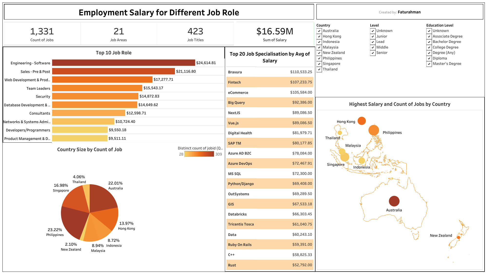

# 📊 End-to-end_Analytical_Workflow_IT_Jobs_in_Asia-Pacific
End-to-end analysis of IT job market in Asia-Pacific. Data cleaned with Python, explored and joined using SQL, visualized in Tableau to reveal trends in skills, tools, programming languages, and their relation to salary and job level.

---

## 🧭 Overview
This project presents a complete analytical workflow exploring IT job market trends in the Asia-Pacific region.  
It covers **data cleaning using Python (Pandas)**, **exploratory data analysis using SQL**, and **interactive visualization using Tableau**.  
The main goal is to identify job demand, required skills, and salary patterns across countries and job levels.

---

## 🎯 Objectives
- Identify the most demanded IT roles, tools, and programming languages.  
- Explore salary distribution by country, specialization, and job level.  
- Translate analytical results into clear, actionable insights.

---

## 🧹 Data Preparation
Data cleaning was performed in **Python**, including handling missing values, standardizing text formats, and filtering relevant attributes.  
After cleaning, a relational **MySQL database** was created based on the dataset, consisting of **6 tables**.  
All SQL scripts and the ERD schema are included in the `data_preparation_after_cleaning` folder.

📂 **Tables:**
- `itjob_header`
- `itjob_main`
- `itjob_tools`
- `itjob_prog_lang`
- `itjob_certification`
- `itjob_main_spec`

📘 **Dataset Source:**  
Dataset of IT Job Vacancies and Requirements in the Asia-Pacific Region  
👉 [Kaggle - Sergey Chekurin (2024)](https://www.kaggle.com/datasets/sergeychekurin/it-jobs-in-asia-pacific-region-may-june-2024)

### 🧩 Entity Relationship Diagram (ERD)

---

## 🧠 Exploratory Data Analysis (SQL)
EDA was conducted using **MySQL** to uncover job demand trends, required skills, and salary insights — focused on **Junior-level IT jobs**.  
All queries are stored in the file `EDA_analysis_IT_Job_by_Junior_level.sql`.

### Key Findings
- **Help Desk & IT Support** is the most demanded job role (119 listings).  
- **IT Support** specialization offers the highest max salary ($59,391).  
- **Indonesia** shows the highest demand for IT Support jobs.  
- **SQL** is the most frequently required programming language.  
- **MS Office**, **CCTV**, and **TCP/IP** are the most common tools.

---

## 📊 Dashboard (Tableau)
An interactive **Tableau dashboard** visualizes job distribution, salary trends, and specialization insights across countries.  
Users can filter data by **country, job level, and education level**.

🔗 **View Dashboard Online:**  
[👉 Tableau Public Link](https://public.tableau.com/views/Book1_17057472858130/Dashboard1?:language=en-US&publish=yes&:sid=&:redirect=auth&:display_count=n&:origin=viz_share_link)

---

## 💡 Insights
- IT Support dominates junior-level IT job listings in the Asia-Pacific region.  
- Indonesia leads in job demand, while Australia and Singapore offer the highest average salaries.  
- SQL remains a key skill across roles, highlighting its importance in the IT industry.  
- Tool proficiency (e.g., MS Office, TCP/IP) continues to be a valuable requirement.  

---

## 🧰 Tools Used
| Tool | Purpose |
|------|----------|
| **Python (Pandas, NumPy)** | Data cleaning and preparation |
| **MySQL** | EDA and query-based insights |
| **Tableau** | Interactive visualization and dashboarding |

---

## 🚀 Next Steps
- Extend EDA using **Python (Matplotlib, Seaborn)** for visual statistical analysis.  
- Develop an **Excel-based dashboard** for business-style reporting.
👉 [Access Here!](https://github.com/faturahman03/Data_Analysis_Job_Specialisation_Dashboard)
- Analyze **correlations** between job specialization and salary growth.  
- Apply **text mining** to identify emerging technology job trends.  

---

## 👤 Author
**Faturahman**  
Aspiring Data Analyst  
📍 Bandung, Indonesia  
🔗 [www.linkedin.com/in/faturahman183] • [233419245+faturahman03@users.noreply.github.com]

